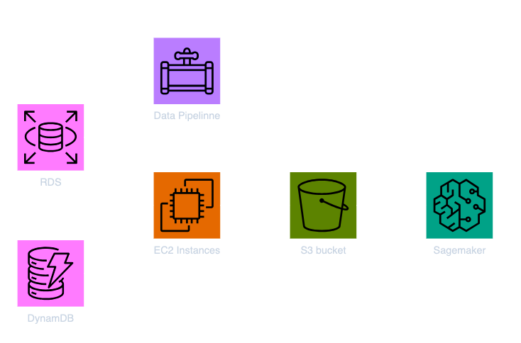
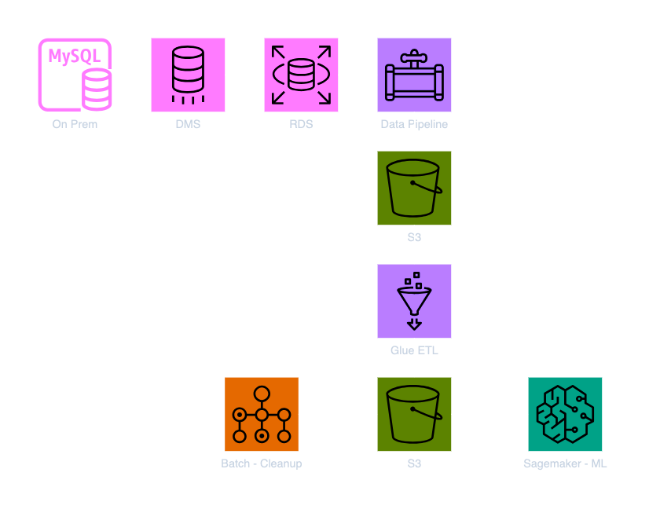

# Data Sources

## Athena

- Data stays in S3 and allows to query using SQL, AWS managed infra
- Uses Presto under the hood
- Supported data format: JSON, CSV, ORC, Parquet, Avro. Can analyze unstructured, semi-structured or structured data
- Example: Analyze log
- Integration with: Jupyter notebooks, QuickSight (Data Visualization) tools, Any tools with ODBC/ JDBC
- Typical workflow: **S3** -> **Glue** (ETL) -> **Athena** (Query) -> **QuickSight** (Visualization)
- Pricing: Pay as you go. Reduce cost when data is columnar (ORC, Parquet)

## Redshift - OLAP

- Data warehouse, stores data in columnar database
- SQL based analytics
- Two mechanisms to get data ready for analysis:

  - Load data from S3 to Redshift
  - Redshift Spectrum to query data directly in S3 withouot loading

- **Redshift Spectrum** : Runs redshift on data on S3 without the need to load data on Redshift first

## RDS, Aurora - OLTP

- Relational Store, SQL based query. stores data in row database

## Dynamo DB - No SQL

- Serverless, good to store machine learning model output

## S3 - Object Storage

## Open Search - Reverese Index

- Index data
- Clickstream Analytics

## ElastiCache - Cache data

## Data Pipeline

- Stages of data transformation to orchestrate data ingestion, ETL, manage task dependencies, retries and notifies on failures
- Destinations: S3, RDS, DynamoDB, Redshift and EMR
- User pays for the underlying EC2 or EMR instances
- Example:
  

## Batch

- Service that optimize any batch job such as data clean up etc. that can be built as a docker image
- Use pays for the underlying EC2 infrastructure, but the batch determines amount of resources required

## Glue vs. Data Pipeline vs. Batch

| Glue                                         | Data Pipelne                                                            | Batch                                                      |
| -------------------------------------------- | ----------------------------------------------------------------------- | ---------------------------------------------------------- |
| ETL Service available as AWS managed Service | Orchestration Service but not a mannaged service                        | Any batch job provided as Docker image (not just ETL)      |
| Runs Apache Spark code for ETL               | Allows to create and control EC2 or EMR instances required for Data ETL | Resources are created automatically similar to ECS service |

## DB Migration Service (DMS)

- Managed service to migrate data from one DB to another. Can be homegenous such as from Oracle to Oracle or can be heterogenous such as from SQL to Aurora
- Source DB stays in service during the migration
- Migration takes place by spinning off EC2 instances that the user is charged for
- In contrast with Glue it is not a batch job, it is a continuous running task

| Glue                         | DMS                                               |
| ---------------------------- | ------------------------------------------------- |
| ETL using Apache Spark       | Data transfer as it is present in source (no ETL) |
| Batch Job                    | Continuos Job                                     |
| After ETL, target can ingest | After migration run Glue for ETL                  |

## Step Functions

- Design workflow with easy visualization
- Audit of history of workflows
- Allows wait in between time (max. of 1 year)

## Example of a Data Engineering Batch Pipeline

## Misc Services

### Datasync

- Tool to transfer data from on prem data center over to AWS systems such as S3 etc
- Requires a Datasync agent to be installed on the customer side which can transfer data from on prem database
- Transfer occurs over Direct Connect or via Internet with encryption enabled

### MQTT

- It is a protocol that IoT devices use to transmit data

### VPC Endpoint Gateway

- Mechanism to privately access S3 from private VPC without going through internet

### Kinesis

- **Kinesis Data Stream** : Real time datastreams
- **Kinesis Data Firehose** : Near Real time data ingestion to S3, Redshift, Elastic Search, Splunk
- **Kinesis Data Analytics** : SQL Transformation on streaming data
- **Kinesis Video Streams** : Real time video feed

### QuickSight

- Data Visualization tool mostly good for performing ad-hoc analysis
- Serverless
- Can Integrate with: Redshift, Aurora/ RDS, Athena, EC2 hosted database, S3 data (CSV), log formats, IoT Analytics
- Can do some limited ETL
- SPICE : Engine is called Superfast, parallel, in memory, calculation engine
