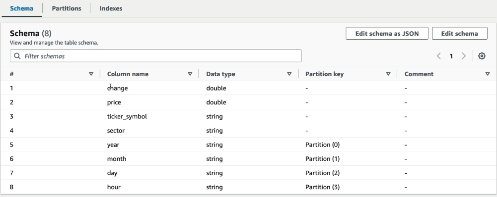
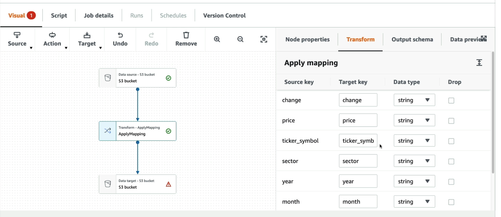

# aws-ml

aws machine learninng project using aws sagemaker

## IAC

- `cdk init sample-app --language=typescript` - This creates the basic cdk infrastructure. One time setup
- `cdk bootstrap` - One time setup to create S3 bucket to store cloud formation templates
- `npm run watch` - Watch for changes and compile
- `iac-stack.ts` file has all the infra definitions
- `cdk diff` - shows what is being planned to change (optional but recommended)
- `cdk synth` - generates cloud formation template (optional)
- `cdk deploy` - deploys the changes to AWS account using cloud formation template that gets generated in the background

# Components required for ML

## Glue Data Catalog

- Metadata repository. it creates schema automatically from S3 data for JSON, CSV, Parquet data
- Can then be integrated into Athena, Redshift, RDS for querying or any analytics
- **Glue Crawler** : Component can work on demand or on schedule to index data from S3
- Cralwer can detect partitions based on how data is organized in S3. Example sub directories created by year/month/day/hour etc.
  Example:
  

  ### Glue ETL

  - Done to transform, clean and enrich data using Pythonn or Scala
  - The flow looks like this

  ```mermaid
  [source s3] -> [Glue ETL Jobs] -> [destination s3]
  ```

  - Target can be S3, JDBC or Glue Data Catalog
  - Jobs can run on serverless platform such as Spark platform
  - Examples of General Transforms:
    - drop fields, drop null fields
    - filter by function
    - join to enrich data
    - map : add fields, delete, lookups
  - Machine Learning Transformation:

    - Find Matches ML : Finds duplicate values smartly even though the field names did not match exactly. This helps in deduplication
    - Format conversions
    - Apache Spark Transformations

  - Example of Glue ETL Job created from studio done in a visual way. This creates Scala script in the background:
    

## Athena

- Define and store results of queries in S3 buckets
- It automatically detects table from Glue Data Catalog
- Athena queries SQL queries those can be directly written against the tables detected

## Clean up after lab

1. Delete Glue Crawler
2. Delete Glue ETL Job
3. Delete Glue Databases created
4. Delete S3 buckets
5. Delete IAM roles
6. Delete Kinesis Firehose delivery streams
7. Delete Kinesis Analytics streams

## Following is the link to ML Certification Prep

- [ML Certification Notes](./AWS-ML-Cert.md)
- [ML General Concept](./ML-General-Concepts.md)
